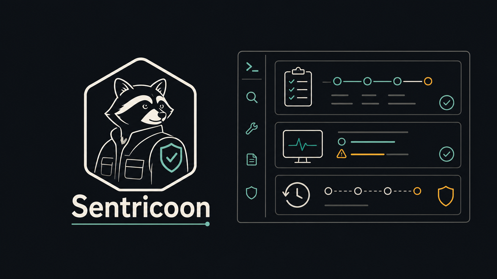

# Sentricoon


**A safety-first OS technician agent for diagnosing, repairing, verifying,
and escalating Linux and Windows system problems. Ubuntu is the first active
development target.**

- Plans OS-aware repair steps from a plain-language task.
- Executes through a small, explicit tool allowlist.
- Verifies results with hard checks, observation, and semantic review.
- Captures snapshots before risky file or process actions.
- Supports dry runs, rollback, audit logs, and human escalation reports.
- Routes LLM roles across OpenAI-compatible cloud and optional local backends.



> **Status:** `0.0.1` alpha. The core agent loop, CLI wiring, native tools,
> dry-run mode, confirmation gates, repair loop, snapshot/rollback path, MCP
> adapter, and test suite are present. Treat it as developer-facing software,
> not a finished unattended repair product.

## How It Works

```text
 user task
    |
    v
+----------+      +----------+      +----------+      +------------+
| Planner  | ---> | Executor | ---> | Verifier | ---> | Done       |
| cloud    |      | tools    |      | 3-layer  |      | or report  |
+-----+----+      +----+-----+      +----+-----+      +------------+
      |                |                 |
      |                v                 |
      |          SafetyGuard             |
      |     allowlist + confirmation     |
      |                                  |
      v                                  v
 procedural memory              Diagnoser + Repairer
 quarantined strategies         retry, replan, escalate

 snapshots + episodic logs are written under the data root
```

Sentricoon owns the **agent layer**: planning, routing, execution policy,
verification, repair attempts, memory, and escalation. The long-term target is
Linux and Windows support; the current implementation focus is Ubuntu first so
the repair loop can become reliable before the Windows surface expands. It does
not try to be a general shell wrapper or an unrestricted automation framework.

## Why It Exists

Most repair agents fail in one of two ways: they are too passive to help, or
they are too willing to mutate the machine without a clear safety model.
Sentricoon is built around the middle path: it can inspect, plan, act, verify,
and recover, but every action is routed through explicit policy.

The goal is a practical OS technician that can handle routine computer repair
work while leaving a human-readable trail of what happened and where manual
intervention is needed.

## What It Is

This repo is a Python runtime for a Linux-and-Windows OS repair agent, with
Ubuntu as the first active implementation target:

- Ubuntu/Linux systemd diagnostics and service-repair primitives
- cross-platform planning hints for Linux, Windows, and macOS
- a native tool router for shell, files, processes, and system info
- an allowlisted action catalog
- confirmation requirements for high-risk operations
- dry-run simulation for write-effect tools
- pre-action snapshots and rollback support
- structured failure reports for human handoff
- episodic JSONL logs for replayable runs
- OpenAI-compatible cloud LLM support
- optional local OpenAI-compatible backend support, such as Ollama
- MCP tool adaptation behind the same safety boundary

Short version:

> Sentricoon is the agent layer for cautious, auditable computer repair.

## What It Is Not

Sentricoon is not:

- a fully unattended admin bot
- a malware-removal product
- a broad desktop automation framework
- a replacement for backups or endpoint management
- a remote-support platform
- a privileged root shell
- a promise that every failed repair can be automatically reversed

The system can perform risky actions only through declared tools and
confirmation gates. Some operations, such as killing a process, can be recorded
for audit but cannot be truly undone.

## Safety Model

The safety model is intentionally small and inspectable.

| Layer | Purpose |
|-------|---------|
| Action allowlist | Rejects any planner action outside the canonical policy. |
| Tool router | Registers only known tool implementations. |
| Confirmation gate | Requires explicit approval for shell commands, deletes, and process kills. |
| Dry-run mode | Simulates write-effect tools without applying side effects. |
| Snapshotter | Captures pre-action file/process state where possible. |
| Verifier | Checks whether the expected state was actually reached. |
| Escalation | Stops loops and writes a report when the agent cannot proceed safely. |

Native actions currently include:

```text
system.info
process.list
process.kill
file.read
file.write
file.delete
shell.run
app.open
browser.open
ubuntu.systemd.failed_units
ubuntu.systemd.status
ubuntu.systemd.restart
```

## Verification Stack

Sentricoon verifies each step in three layers:

| Layer | Behavior |
|-------|----------|
| Hard verifier | Checks deterministic tool results, such as exit code or read success. |
| Observation verifier | Re-reads system state after mutations, such as file writes or deletes. |
| Semantic verifier | Uses an LLM to judge ambiguous evidence against the expected state. |

The planner is required to produce concrete `expected_state` predicates so the
verifier has something meaningful to audit.

## Quick Start

Use `uv` from the repo root. The project currently has no runtime dependencies
beyond the standard library, and the tests can run through Python's built-in
`unittest` runner.

```bash
# From the repo root
uv run python -m sentricoon.main --help
```

Configure a cloud LLM API key:

```bash
export SENTRICOON_CLOUD_API_KEY="your-api-key"
```

Run a dry plan and simulated execution:

```bash
uv run python -m sentricoon.main --dry-run "report the OS distribution and kernel version"
```

Run with confirmation prompts enabled:

```bash
uv run python -m sentricoon.main "diagnose why my audio service is not running"
```

Auto-approve high-risk actions only when you understand the task and the
machine state:

```bash
uv run python -m sentricoon.main --yes "restart the audio service"
```

Rollback from a snapshot path printed by a failed or escalated run:

```bash
uv run python -m sentricoon.main --rollback ~/.os-technician/snapshots/<snapshot>.json
```

## Configuration

Configuration is read from environment variables at process start.

| Variable | Default | Purpose |
|----------|---------|---------|
| `SENTRICOON_CLOUD_API_KEY` | unset | API key for the cloud LLM backend. |
| `OPENAI_API_KEY` | unset | Fallback cloud API key. |
| `ANTHROPIC_API_KEY` | unset | Fallback key accepted by the config layer. |
| `SENTRICOON_CLOUD_BASE_URL` | `https://api.openai.com/v1` | OpenAI-compatible cloud endpoint. |
| `SENTRICOON_CLOUD_MODEL` | `gpt-4o-mini` | Cloud model name. |
| `SENTRICOON_LOCAL_ENABLED` | unset | Set to `1`, `true`, or `yes` to enable local routing. |
| `SENTRICOON_LOCAL_BASE_URL` | `http://localhost:11434/v1` | OpenAI-compatible local endpoint. |
| `SENTRICOON_LOCAL_MODEL` | `llama3.2:3b` | Local model name. |
| `SENTRICOON_DATA_ROOT` | `~/.os-technician` | Root for runs, snapshots, and failure reports. |
| `SENTRICOON_MAX_RETRIES_PER_STEP` | `3` | Repair attempts per failed step. |

## Repo Layout

| Path | Purpose |
|------|---------|
| `sentricoon/main.py` | CLI entry point and subsystem wiring. |
| `sentricoon/agent.py` | Main observe-plan-execute-verify-repair loop. |
| `sentricoon/planner.py` | LLM planner and plan validation. |
| `sentricoon/executor.py` | Tool execution with dry-run support. |
| `sentricoon/verifier.py` | Hard, observation, and semantic verification. |
| `sentricoon/diagnoser.py` | Failure diagnosis for unsuccessful steps. |
| `sentricoon/repair.py` | Retry, input repair, and replanning decisions. |
| `sentricoon/safety/` | Allowlist and confirmation policy. |
| `sentricoon/tools/` | Native tool implementations. |
| `sentricoon/mcp/` | MCP client and tool adapter. |
| `sentricoon/snapshot.py` | Snapshot and rollback primitives. |
| `sentricoon/escalation.py` | Budgets, loop detection, and failure reports. |
| `tests/` | Unit tests for the agent runtime. |

## Development

Run the test suite:

```bash
uv run python -m unittest discover
```

Useful local checks:

```bash
uv run python -m sentricoon.main --help
uv run python -m sentricoon.main --dry-run "show memory usage"
```

Related docs:

- [Project Direction](PROJECT_DIRECTION.md)
- [Benchmarks](BENCHMARKS.md)
- [Ubuntu Testing Guide](UBUNTU_TESTING.md)
- [Ubuntu Plugin Plan](UBUNTU_PLUGIN_PLAN.md)
- [Windows Testing Guide](WINDOWS_TESTING.md)

## Current Direction

The near-term direction is to keep the runtime narrow and dependable:

- stronger OS-specific repair catalogs
- richer rollback coverage for services and settings
- more focused MCP integration examples
- clearer operator-facing reports
- tighter verification predicates
- packaging metadata for easier installation

The project should stay small enough that every tool, policy decision, and
side effect can be audited by a developer before trusting it on a real machine.
